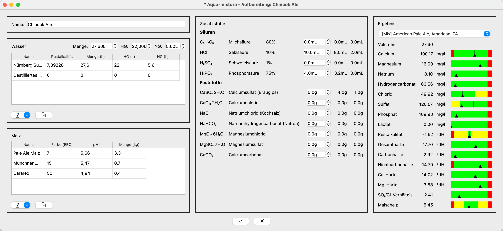

# How-To
Operating instructions for Aqua-mixtura

## General operating elements
The following operating elements are used at various points in the programme.

|                       Icon                       | Action                               |
| :----------------------------------------------: | :----------------------------------- |
|            | Add a new element                    |
|      | Copy selected element                |
|        | Delete selected element              |
|  | Import element from JSON file        |
|    | Export selected element as JSON file |
|                   | Save all changes                     |
|                | Discard all changes                  |

## Main window
The main window provides access to all parts of the application.
The various setting pages of the application can be accessed in the left-hand area.
All water treatments are displayed in the right-hand area.
Double-click on the corresponding line to open the water treatment.

## Water sources
The various water sources for the treatments are defined here.
All waters used must be entered.
For example, the values of your own tap water.

The first time the programme is started, an initial list of water sources is loaded.

## Additives
The concentration of the acids used is set here and whether they are specified in millilitres or grams.
The concentration is given as mass fraction in accordance with DIN 1310.

## Malts
Frequently used malts can be predefined here.

An initial malt list is loaded when the programme is started for the first time.

## Beer styles
The various beer styles are defined here.
The corresponding beer style is selected in the left-hand area.
The beer style can be edited in the right-hand area.
* The values relevant to the beer style are selected in the `Limit` column.
Only rows with a tick are taken into account for this beer style.
* The `Minimum` column indicates the minimum for this beer style.
* The `Target` column indicates the desired value for this beer style.
* The `Maximum` column indicates the maximum for this beer style.

The first time the programme is started, an initial list of beer styles is loaded.

## Preferences
The limits of the various water values are defined here.
* The `Minimum` column indicates the minimum sensible value for brewing beer.
* The `Maximum` column indicates the maximum sensible value for brewing beer.
* The `Negative values` column indicates whether negative values are permitted.

The default preferences are loaded when the programme is started for the first time.

## Mixture
This is where the water is treated.
Once treatment has been carried out, it is persistent.
All the water, malts, additives and the beer styles used are saved.
Changes to the water, malts and additives therefore have no effect on existing treatments.
Only if the additives have changed the displayed values are converted accordingly without affecting the preparation.
If a malt or water is to be updated, it must be removed and added again.

The window is divided into three columns.

### Left column: Name, water, malt
The name, waters and malts are entered in the left-hand column.

Any number of waters can be added.
The amount of water in litres must be entered in the column ‘Amount (L)’.
Missing water must be defined under [Water sources](#water-sources).

Any number of malts can be added.
However, this has no influence on the result as the pH value of the mash is not yet calculated.

### Centre column: Additives
The quantity of the various additives can be set in the centre column.

Changes to the concentration and unit of the [Additives](#additive) are adopted and converted directly.
Internally, the calculation is always based on a fictitious concentration of 100% and in grams.

### Right column: Result
The resulting water profile is displayed here.

The beer style can be selected via a drop-down menu.
The beer style contained in the preparation is identified by the prefix `[Mix]`.
When saving, the beer style of the preparation is replaced by the currently selected beer style.

The water profile is displayed numerically and graphically.
The current value is represented by a black triangle.
If the triangle points to the right or left, the value is outside the displayed scale.
The scale is divided into colours.
The limit values of the [Preferences](#preferences) and the specifications of the [Beer style](#beer-styles) are taken into account.

| Colour     | Meaning                                                          |
| :--------- | :--------------------------------------------------------------- |
| Red        | Absolute minimum and maximum through limit values and beer style |
| Yellow     | Values within the limits but outside the beer style              |
| Green      | Values within the beer style and limits                          |
| Dark green | Target value from beer style                                     |

As not all values are always defined in a beer style, the yellow and dark green areas are not always present.

