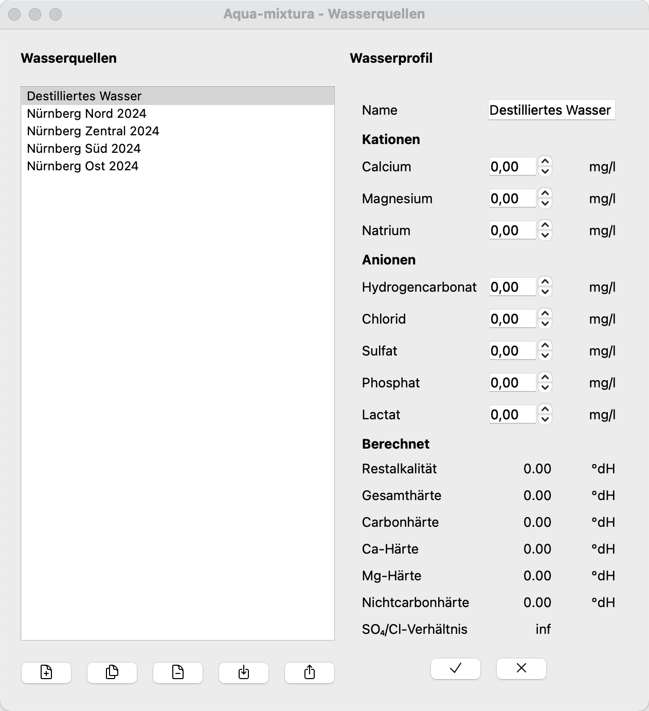
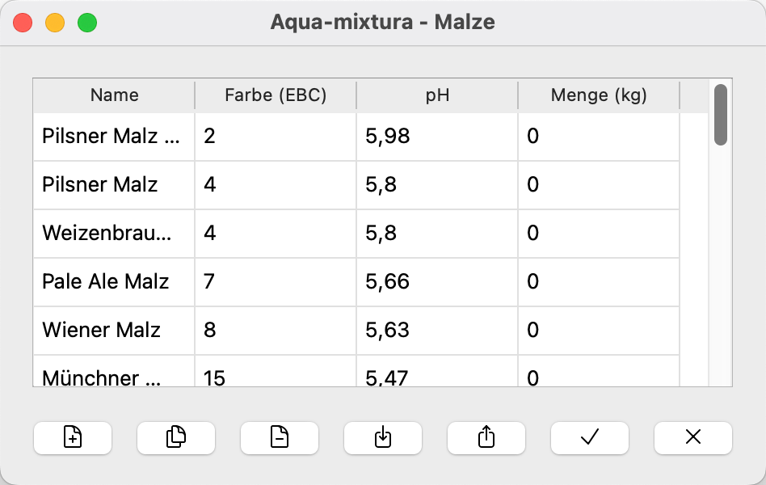
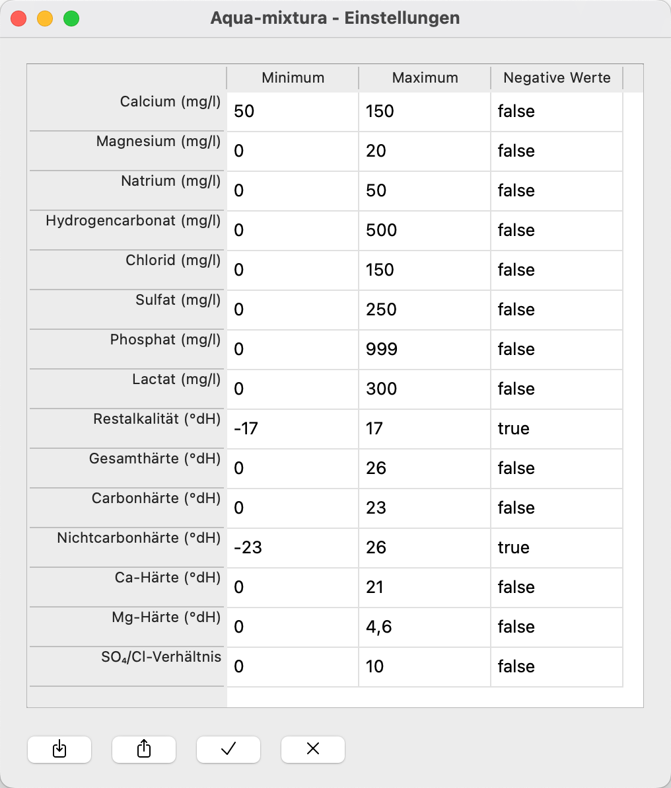

# Anleitung
Bedienungsanleitung für Aqua-mixtura

## Allgemeine Bedienelemente
Die folgenden Bedienelemente werden an verschiedenen Stellen im Programm verwendet.

|                        Symbol                         | Aktion                                          |
| :---------------------------------------------------: | :---------------------------------------------- |
|          | Ein neues Element hinzufügen                    |
|       | Ausgewähltes Element kopieren                   |
|            | Ausgewähltes Element löschen                    |
|  | Element aus JSON-Datei importieren              |
|    | Ausgewähltes Element als JSON-Datei exportieren |
|                   | Alle Änderungen speichern                       |
|                  | Alle Änderungen verwerfen                       |

## Hauptfenster
Das Hauptfenster bietet Zugang zu allen Teilen der Anwendung.
Im linken Bereich kann auf die verschiedenen Einstellungsseiten der Anwendung zugegriffen werden.
Im rechten Bereich werden alle Wasseraufbereitungen angezeigt.
Durch einen Doppelklick auf die entsprechende Zeile wird die Wasseraufbereitung geöffnet.

## Wasserquellen
Hier werden die verschiedenen Wasserquellen für die Aufbereitungen definiert.
Alle verwendeten Wässer müssen eingetragen werden.
Zum Beispiel die Werte des eigenen Leitungswassers.

Beim ersten Programmstart wird eine initiale Liste von Wasserquellen geladen.

## Zusatzstoffe
Hier wird die Konzentration der verwendeten Säuren eingestellt und ob diese in Milliliter oder Gramm angegeben werden.
Die Konzentration wird als Massenanteil gemäß DIN 1310 angegeben.

## Malze
Hier können häufig verwendete Malze vordefiniert werden.

Beim ersten Programmstart wird eine initiale Malzliste geladen.

## Bierstile
Hier werden die verschiedenen Bierstile definiert.
Im linken Bereich wird der entsprechende Bierstil ausgewählt.
Im rechten Bereich kann der Bierstil editiert werden.
* In der Spalte `Limitieren` werden die für den Bierstil relevanten Werte ausgewählt.
Nur Zeilen mit einem  Häkchen werden bei der Aufbereitung für diesen Bierstil berücksichtigt.
* Die Spalte `Minimum` gibt das Minimum für diesen Bierstil an.
* Die Spalte `Ziel` gibt den gewünschten Wert für diesen Bierstil an.
* Die Spalte `Maximum` gibt das Maximum für diesen Bierstil an.

Beim ersten Programmstart wird eine initiale Liste von Bierstilen geladen.

## Einstellungen
Hier werden die Grenzen der verschiedenen Wasserwerte definiert.
* Die Spalte `Minimum` gibt den minimal sinnvollen Wert für das Bierbrauen an.
* Die Spalte `Maximum` gibt den maximal sinnvollen Wert für das Bierbrauen an.
* Die Spalte `Negative Werte` gibt an ob negative Werte erlaubt sind.

Beim ersten Programmstart werden die Standardeinstellungen geladen.

## Aufbereitung

Hier wird das Wasser aufbereitet.
Eine einmal durchgeführte Aufbereitung ist persistent.
Hierfür werden alle verwendeten Wässer, Malze, Zusatzstoffe und der Bierstiel mit abgespeichert.
Änderungen an den Wässern, Malzen und Zusatzstoffen haben daher keinen Einfluss auf bestehende Aufbereitungen. Lediglich bei den Zusatzstoffen werden die angezeigten Werte entsprechend umgerechnet, ohne jedoch die Aufbereitung zu beeinflussen.
Soll ein Malz oder Wasser aktualisiert werden, so muss dies entfernt und wieder hinzugefügt werden.

Das Fenster ist in drei Spalten unterteilt.

### Linke Spalte: Name, Wasser, Malz

In der linken Spalte werden der Name, die Wässer und die Malze eingegeben.

Es können beliebig viele Wässer hinzugefügt werden.
In der Spalte `Menge (L)` ist die Menge des Wassers in Litern anzugeben.
Fehlende Wässer müssen unter [Wasserquellen](#wasserquellen) definiert werden.

Es können beliebig viele Malze hinzugefügt werden.
Dies hat jedoch noch keinen Einfluss auf das Ergebnis, da der pH-Wert der Maische noch nicht berechnet wird.

### Mittlere Spalte: Zusatzstoffe

In der mittleren Spalte kann die Menge der verschiedenen Zusatzstoffe eingestellt werden.

Änderungen der Konzentration und Einheit der [Zusatzstoffe](#zusatzstoffe) werden direkt übernommen und umgerechnet.
Intern wird immer mit einer fiktiven Konzentration von 100% und in Gramm gerechnet.

### Rechte Spalte: Ergebnis

Hier wird das resultierende Wasserprofil angezeigt.

Der Bierstil kann über ein Dropdown-Menü ausgewählt werden.
Der in der Aufbereitung enthaltene Bierstil wird durch das Präfix `[Mix]` gekennzeichnet.
Beim Speichern wird der Bierstil der Aufbereitung durch den aktuell ausgewählten Bierstil ersetzt.

Das Wasserprofil wird numerisch und grafisch dargestellt.
Der aktuelle Wert wird durch ein schwarzes Dreieck dargestellt.
Zeigt das Dreieck nach rechts oder links, liegt der Wert außerhalb der dargestellten Skala.
Die Skala ist farblich unterteilt.
Dabei werden die Grenzwerte der [Einstellungen](#einstellungen) sowie die Vorgaben des [Bierstils](#bierstile) berücksichtigt.

| Farbe      | Bedeutung                                                    |
| :--------- | :----------------------------------------------------------- |
| Rot        | Absolutes Minimum und Maximum durch Grenzwerte und Bierstil  |
| Gelb       | Werte innerhalb der Grenzwerte, aber außerhalb des Bierstils |
| Grün       | Werte innerhalb des Bierstils und der Grenzwerte             |
| Dunkelgrün | Zielwert aus Bierstil                                        |

Da nicht immer alle Werte in einem Bierstil definiert sind, sind die gelben und dunkelgrünen Bereiche nicht immer vorhanden.

